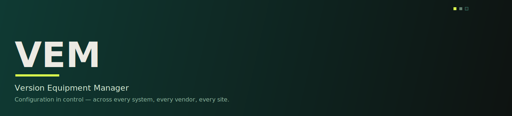

 

## / 01 - What is VEM?
VEM is a configuration & version-control platform for continuously validated production.

VEM holds a single, immutable configuration baseline across every system on a line - PLC, SCADA/HMI, vision, robotics, printers, databases - and continuously monitors it for drift.

## /02 - What we're solving
Manufacturing lines run on config scattered across a dozen vendors and tools. When something drifts, nobody can prove what changed, when, or why - until FAT/SAT fails or an audit does. VEM makes configuration the source of truth instead of an afterthought.

## /03 - Three pillars
1. **Baseline & Compare** - capture immutable baselines at every phase boundary, diff any two versions.
2. **Monitor & Detect** - continuous drift detection, attributed and surfaced to the right owner.
3. **Version History** — full, searchable, time-ordered audit trail of every in-control change.
